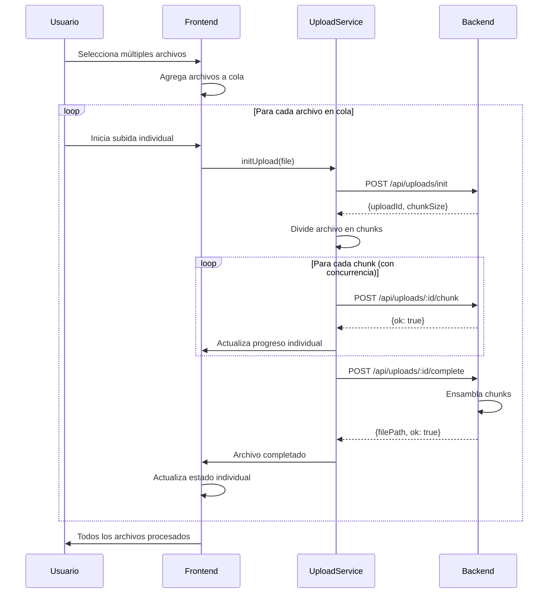

# Uploader POC - Multi-File Chunked Upload

[](https://angular.io/)
[](https://nodejs.org/)
[](https://www.typescriptlang.org/)

**Prueba de concepto (POC)** para subir **múltiples archivos** de cualquier tamaño usando **chunked multipart uploads** con Angular 20 y backend Node.js/Express. Optimizada para archivos grandes (1GB - 10GB+) con configuración automática de chunks, concurrencia inteligente y gestión individual de progreso por archivo.

## Características Principales

### Gestión de Múltiples Archivos
- **Subida simultánea** de múltiples archivos con progreso individual
- **Gestión independiente** de pausa/reanudación por archivo
- **Estado granular** para cada archivo (subiendo, pausado, ensamblando, completado)
- **Control individual** para cancelar archivos específicos

### Optimización Inteligente
- **Subida en chunks** con tamaño dinámico (5MB - 100MB según archivo)
- **Configuración automática** basada en tamaño del archivo
- **Concurrencia adaptativa** (1-6 chunks simultáneos por archivo)
- **Reintentos automáticos** con backoff exponencial

### Experiencia de Usuario Avanzada
- **Progreso detallado** con velocidad y tiempo estimado (ETA) por archivo
- **Drag & Drop múltiple** y selección manual de archivos
- **Interfaz reactiva** con Angular Signals y effects
- **Pausar/Reanudar/Cancelar** subidas globales o individuales
- **Estados visuales** claros (subiendo, ensamblando, completado, error)

### Robustez y Confiabilidad
- **Manejo robusto de errores** con recuperación automática
- **Soporte para cualquier tipo de archivo** y tamaño
- **Detección de pausa inteligente** durante la subida de chunks
- **Limpieza automática** de archivos temporales en el servidor

## Arquitectura del Proyecto

```
uploader_poc/
├── angular-uploader/           # Frontend Angular 20
│   ├── src/app/
│   │   ├── app.component.ts    # Componente raíz
│   │   ├── services/
│   │   │   └── upload.service.ts   # Lógica de subida chunked
│   │   └── uploader/
│   │       ├── uploader.component.ts   # UI y gestión de estado
│   │       ├── uploader.component.html # Template del uploader
│   │       └── uploader.component.css  # Estilos del componente
│   └── proxy.conf.json         # Proxy para API calls
└── node-backend/               # Backend Node.js/Express
    ├── index.ts                # Servidor principal con endpoints
    ├── uploads/                # Archivos finales procesados
    └── tmp_uploads/            # Almacenamiento temporal de chunks
```

## Tecnologías Utilizadas

### Frontend (Angular 20)
- **Framework**: Angular 20.2.0 con componentes standalone
- **Reactive State**: Angular Signals para UI reactiva con effects automáticos
- **HTTP Client**: HttpClient para comunicación con el backend
- **RxJS**: Observables para manejo asíncrono de streams y concurrencia
- **TypeScript**: 5.8.2 para tipado estático y interfaces robustas
- **Multi-File Management**: Gestión de estado individual por archivo

### Backend (Node.js)
- **Runtime**: Node.js con Express 4.18.2
- **File Processing**: Multer para manejo de multipart uploads
- **CORS**: Configurado para desarrollo local
- **TypeScript**: Compilación con ts-node para desarrollo

## Configuración Automática por Tamaño

El sistema ajusta automáticamente la estrategia de subida según el tamaño del archivo:

| Tamaño del Archivo | Chunk Size | Concurrencia | Reintentos | Uso Típico |
|-------------------|------------|--------------|------------|------------|
| ≤ 50 MB | 5 MB | 6 chunks | 3 | PDFs, documentos, imágenes |
| 50 MB - 500 MB | 10 MB | 4 chunks | 3 | Videos cortos, archivos medianos |
| 500 MB - 2 GB | 25 MB | 3 chunks | 4 | Videos largos, archivos pesados |
| 2 GB - 10 GB | 50 MB | 2 chunks | 5 | Videos 4K, archivos muy pesados |
| > 10 GB | 100 MB | 1 chunk | 5 | Archivos extremadamente grandes |

---

## Guía de Instalación y Uso

### Prerrequisitos
- Node.js (v18 o superior)
- npm o yarn

### 1. Configuración del Backend

```bash
cd node-backend
npm install
npm run start
```

El servidor se levanta en **http://localhost:3000** y crea automáticamente:
- `uploads/` - Directorio para archivos finales
- `tmp_uploads/` - Directorio temporal para chunks

### 2. Configuración del Frontend

En una nueva terminal:

```bash
cd angular-uploader
npm install
npm start
```

La aplicación estará disponible en **http://localhost:4200**
- El proxy ya está configurado para enviar `/api/*` al backend
- Hot-reload habilitado para desarrollo

### 3. Uso de la Aplicación

#### Gestión de Múltiples Archivos
1. **Selección múltiple**: Arrastra varios archivos o selecciona múltiples desde el explorador
2. **Vista de cola**: Visualiza todos los archivos en cola con su estado individual
3. **Configuración automática**: El sistema optimiza chunks según el tamaño de cada archivo
4. **Control granular**: Inicia, pausa, reanuda o cancela archivos individuales

#### Flujo de Subida
1. **Subida batch**: Haz clic en "Subir Todos" para procesar toda la cola
2. **Subida individual**: Controla cada archivo por separado
3. **Monitoreo avanzado**: Observa progreso, velocidad y ETA por archivo
4. **Estados visuales**: Identifica rápidamente el estado de cada archivo
   - **Pendiente**: Archivo en cola esperando subida
   - **Subiendo**: Chunks siendo enviados al servidor
   - **Ensamblando**: Servidor uniendo chunks en archivo final
   - **Completado**: Archivo procesado exitosamente
   - **Error**: Problema durante la subida (con reintentos automáticos)

---

## API Endpoints

### POST `/api/uploads/init`
Inicializa una nueva sesión de subida.

**Request Body:**
```json
{
  "fileName": "video.mp4",
  "fileSize": 1073741824,
  "mimeType": "video/mp4"
}
```

**Response:**
```json
{
  "uploadId": "a1b2c3d4e5f6...",
  "recommendedChunkSize": 10485760,
  "uploadedChunks": []
}
```

### POST `/api/uploads/:uploadId/chunk`
Sube un chunk individual del archivo.

**Request:** Multipart form-data
- `chunk`: Archivo binario del chunk
- `chunkIndex`: Índice del chunk (0-based)

**Response:**
```json
{
  "ok": true,
  "stored": "/path/to/temp/part_0"
}
```

### POST `/api/uploads/:uploadId/complete`
Ensambla todos los chunks en el archivo final.

**Request Body:**
```json
{
  "totalChunks": 42,
  "fileName": "video.mp4"
}
```

**Response:**
```json
{
  "ok": true,
  "filePath": "/uploads/video.mp4",
  "originalFileName": "video.mp4",
  "sanitizedFileName": "video.mp4"
}
```

---

## Flujo de Trabajo Multi-Archivo



## Métricas de Rendimiento

### Configuraciones Testadas (Por Archivo)
- **Archivos pequeños** (< 50MB): 5MB chunks, 6 concurrent → ~30-60s
- **Videos medianos** (500MB): 10MB chunks, 4 concurrent → ~2-5 min
- **Archivos grandes** (2GB): 25MB chunks, 3 concurrent → ~8-15 min
- **Videos 4K** (5GB+): 50MB chunks, 2 concurrent → ~20-40 min

### Gestión de Múltiples Archivos
- **5-10 archivos simultáneos**: Rendimiento óptimo sin saturar conexión
- **Gestión de memoria**: Chunks procesados de forma streaming (no almacenados en RAM)
- **Balanceador inteligente**: Evita sobrecargar el servidor con demasiados chunks concurrentes
- **Recuperación granular**: Errores en un archivo no afectan otros en proceso

### Factores que Afectan el Rendimiento
- **Velocidad de conexión**: Principal limitante para múltiples archivos
- **Concurrencia por archivo**: Optimizada automáticamente según tamaño
- **Número de archivos simultáneos**: Recomendado máximo 10 archivos grandes
- **Memoria del navegador**: Gestión eficiente con streaming de chunks
- **Capacidad del servidor**: Escalable con load balancing

---

## Desarrollo y Testing

### Estructura del Código

**Frontend - UploadService** (`src/app/services/upload.service.ts`)
- Configuración automática basada en tamaño de archivo
- Manejo de estado reactivo con BehaviorSubjects
- Pipeline RxJS para concurrencia controlada por archivo
- Cálculo de métricas en tiempo real (velocidad, ETA)
- **Nuevos métodos para múltiples archivos**:
  - `uploadFileMultipartWithProgress()`: Progreso individual por archivo
  - Callbacks de progreso y ensamblado por archivo
  - Gestión independiente de pausa/reanudación

**Frontend - UploaderComponent** (`src/app/uploader/uploader.component.ts`)
- **Gestión de múltiples archivos** con signals y effects
- UI reactiva con estado individual por archivo
- Soporte para Drag & Drop múltiple
- Controles granulares de pausa/reanudación/cancelación
- **Nuevas interfaces**:
  - `FileUploadState`: Estado completo por archivo
  - `addFiles()`: Agregar múltiples archivos a la cola
  - Estados visuales avanzados (subiendo, ensamblando, etc.)

**Backend** (`index.ts`)
- Endpoints RESTful para gestión de chunks
- Almacenamiento temporal seguro por archivo
- Ensamblado secuencial con limpieza automática
- Sanitización de nombres de archivo
- **Soporte mejorado**:
  - Manejo concurrente de múltiples sesiones de upload
  - Validación robusta de chunks y metadatos
  - Logs detallados para debugging

### Testing Manual
```bash
# Backend - Test endpoints
curl -X POST http://localhost:3000/api/uploads/init \
  -H "Content-Type: application/json" \
  -d '{"fileName":"test.pdf","fileSize":1024,"mimeType":"application/pdf"}'

# Frontend - Console debug para múltiples archivos
# Abre DevTools y monitorea:
# - Network tab para chunks individuales de cada archivo
# - Console para logs de progreso por archivo
# - Application storage para estado de la cola
# - Performance tab para monitorear memoria con múltiples archivos

# Testing de concurrencia
# 1. Selecciona 5-10 archivos de diferentes tamaños
# 2. Inicia subida de todos simultáneamente
# 3. Prueba pausar/reanudar archivos individuales
# 4. Verifica que errores en un archivo no afecten otros
```

## Nuevas Funcionalidades Implementadas

### Multi-File Upload
- **Cola de archivos**: Gestión completa de múltiples archivos en una sola interfaz
- **Progreso individual**: Cada archivo mantiene su propio estado y progreso
- **Control granular**: Pausa, reanuda, cancela archivos específicos
- **Estados avanzados**: Pendiente → Subiendo → Ensamblando → Completado/Error

### Mejoras en el UploadService
- **Nuevos métodos**: `uploadFileMultipartWithProgress()` para callbacks individuales
- **Progreso por archivo**: No interfiere con el estado global del servicio
- **Callbacks especializados**: Progreso y ensamblado con datos específicos por archivo
- **Gestión de memoria optimizada**: Chunks procesados en streaming

### Interfaz Mejorada
- **Angular 20 Effects**: Gestión automática de estado reactivo
- **Signals avanzados**: Estado individual y global sincronizado
- **Drag & Drop múltiple**: Soporte nativo para múltiples archivos
- **Indicadores visuales**: Estados claros para cada archivo en la cola

### Robustez Empresarial
- **Error handling granular**: Errores por archivo no afectan la cola completa
- **Reintentos inteligentes**: Configuración adaptativa según el tipo de error
- **Logs detallados**: Debugging mejorado para entornos de producción
- **Cleanup automático**: Gestión de memoria y limpieza de temporales

---

## Mejoras para Producción

### Seguridad
- [ ] Autenticación/autorización de usuarios
- [ ] Validación de tipos de archivo (whitelist)
- [ ] Límites de tamaño por usuario/plan
- [ ] Rate limiting por IP/usuario
- [ ] Escaneado de malware en archivos

### Escalabilidad
- [ ] Almacenamiento en la nube (AWS S3, Google Cloud Storage)
- [ ] CDN para distribución de archivos
- [ ] Base de datos para metadatos de archivos
- [ ] Queue system para procesamiento asíncrono
- [ ] Load balancer para múltiples instancias

### Monitoreo
- [ ] Logging estructurado (Winston, Pino)
- [ ] Métricas de performance (Prometheus)
- [ ] Alertas de errores (Sentry)
- [ ] Dashboard de uso y estadísticas

### Funcionalidades Avanzadas
- **Multi-file resume**: Reanudar múltiples archivos después del cierre del navegador
- **Batch operations**: Operaciones en lote (pausar todos, cancelar todos, etc.)
- **File deduplication**: Detección automática de archivos duplicados
- **Progress analytics**: Estadísticas detalladas de velocidad y eficiencia
- **Drag & drop folders**: Soporte para arrastrar carpetas completas
- **File preview system**: Vista previa de archivos subidos
- **Smart retry strategies**: Estrategias de reintento específicas por tipo de error
- **Bandwidth optimization**: Adaptación automática según velocidad de conexión
- **Parallel processing**: Procesamiento paralelo optimizado en el servidor
- **Real-time notifications**: Notificaciones push de estado por archivo

---

## Contribuciones y Licencia

### Contribuir
Las contribuciones son bienvenidas. Por favor:

1. Fork el repositorio
2. Crea una rama para tu feature (`git checkout -b feature/amazing-feature`)
3. Commit tus cambios (`git commit -m 'Add amazing feature'`)
4. Push a la rama (`git push origin feature/amazing-feature`)
5. Abre un Pull Request

### Roadmap
- [ ] **Tests unitarios y de integración** para múltiples archivos
- [ ] **Docker containers** para deployment escalable
- [ ] **Documentación de API** con Swagger/OpenAPI
- [ ] **WebSocket integration** para notificaciones en tiempo real
- [ ] **Ejemplo de integración** con AWS S3 multipart
- [ ] **Tutorial paso a paso** con casos de uso empresariales
- [ ] **Performance benchmarks** con múltiples archivos grandes
- [ ] **Mobile optimization** para dispositivos móviles
- [ ] **Plugin system** para extensiones personalizadas
- [ ] **Analytics dashboard** para métricas de uso

---

**Autor**: Fernando Orozco  
**Última actualización**: Agosto 2025  
**Versión**: 2.0 - Multi-File Upload

> **Nota**: Esta es una POC desarrollada para una aplicación empresarial con funcionalidad de múltiples archivos. Para entornos de producción, considera las mejoras de seguridad y escalabilidad mencionadas arriba.
