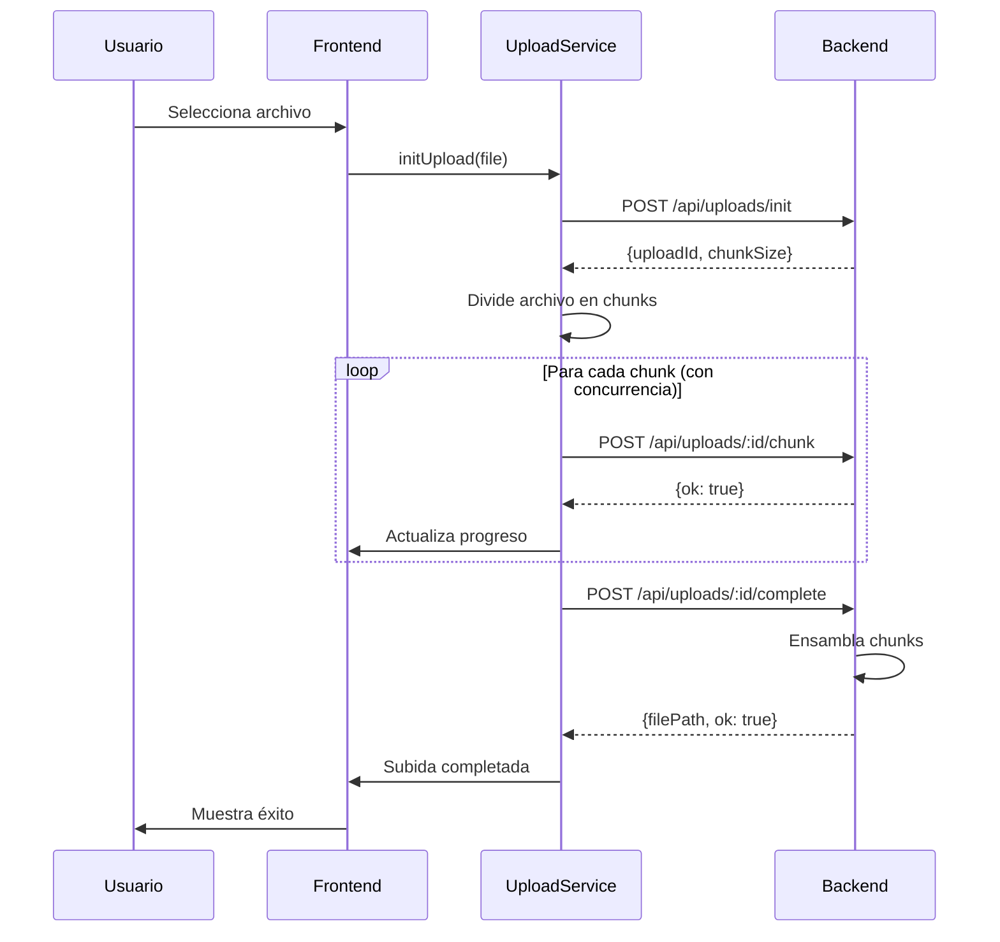

# Uploader POC - Chunked File Upload

[](https://angular.io/)
[](https://nodejs.org/)
[

**Prueba de concepto (POC)** para subir archivos de cualquier tamaño usando **chunked multipart uploads** con Angular 20 y backend Node.js/Express. Optimizada para archivos grandes (1GB - 10GB+) con configuración automática de chunks y concurrencia.

## Características Principales

- **Subida en chunks** con tamaño dinámico (5MB - 100MB según archivo)
- **Configuración automática** basada en tamaño del archivo
- **Concurrencia inteligente** (1-6 chunks simultáneos)
- **Pausar/Reanudar/Cancelar** subidas en tiempo real
- **Progreso detallado** con velocidad y tiempo estimado (ETA)
- **Drag & Drop** y selección manual de archivos
- **Interfaz reactiva** con Angular Signals
- **Manejo robusto de errores** con reintentos automáticos
- **Soporte para cualquier tipo de archivo**

## Arquitectura del Proyecto

```
uploader_poc/
├── angular-uploader/           # Frontend Angular 20
│   ├── src/app/
│   │   ├── app.component.ts    # Componente raíz
│   │   ├── services/
│   │   │   └── upload.service.ts   # Lógica de subida chunked
│   │   └── uploader/
│   │       ├── uploader.component.ts   # UI y gestión de estado
│   │       ├── uploader.component.html # Template del uploader
│   │       └── uploader.component.css  # Estilos del componente
│   └── proxy.conf.json         # Proxy para API calls
└── node-backend/               # Backend Node.js/Express
    ├── index.ts                # Servidor principal con endpoints
    ├── uploads/                # Archivos finales procesados
    └── tmp_uploads/            # Almacenamiento temporal de chunks
```

## Tecnologías Utilizadas

### Frontend (Angular 20)
- **Framework**: Angular 20.2.0 con componentes standalone
- **Reactive State**: Angular Signals para UI reactiva
- **HTTP Client**: HttpClient para comunicación con el backend
- **RxJS**: Observables para manejo asíncrono de streams
- **TypeScript**: 5.8.2 para tipado estático

### Backend (Node.js)
- **Runtime**: Node.js con Express 4.18.2
- **File Processing**: Multer para manejo de multipart uploads
- **CORS**: Configurado para desarrollo local
- **TypeScript**: Compilación con ts-node para desarrollo

## Configuración Automática por Tamaño

El sistema ajusta automáticamente la estrategia de subida según el tamaño del archivo:

| Tamaño del Archivo | Chunk Size | Concurrencia | Reintentos | Uso Típico |
|-------------------|------------|--------------|------------|------------|
| ≤ 50 MB | 5 MB | 6 chunks | 3 | PDFs, documentos, imágenes |
| 50 MB - 500 MB | 10 MB | 4 chunks | 3 | Videos cortos, archivos medianos |
| 500 MB - 2 GB | 25 MB | 3 chunks | 4 | Videos largos, archivos pesados |
| 2 GB - 10 GB | 50 MB | 2 chunks | 5 | Videos 4K, archivos muy pesados |
| > 10 GB | 100 MB | 1 chunk | 5 | Archivos extremadamente grandes |

---

## Guía de Instalación y Uso

### Prerrequisitos
- Node.js (v18 o superior)
- npm o yarn

### 1. Configuración del Backend

```bash
cd node-backend
npm install
npm run start
```

El servidor se levanta en **http://localhost:3000** y crea automáticamente:
- `uploads/` - Directorio para archivos finales
- `tmp_uploads/` - Directorio temporal para chunks

### 2. Configuración del Frontend

En una nueva terminal:

```bash
cd angular-uploader
npm install
npm start
```

La aplicación estará disponible en **http://localhost:4200**
- El proxy ya está configurado para enviar `/api/*` al backend
- Hot-reload habilitado para desarrollo

### 3. Uso de la Aplicación

1. **Selección de archivo**: Arrastra y suelta o haz clic para seleccionar
2. **Configuración automática**: El sistema optimiza chunks según el tamaño
3. **Subida**: Haz clic en "Subir" para iniciar el proceso
4. **Control total**: Pausa, reanuda o cancela en cualquier momento
5. **Monitoreo**: Observa progreso, velocidad y tiempo estimado en tiempo real

---

## API Endpoints

### POST `/api/uploads/init`
Inicializa una nueva sesión de subida.

**Request Body:**
```json
{
  "fileName": "video.mp4",
  "fileSize": 1073741824,
  "mimeType": "video/mp4"
}
```

**Response:**
```json
{
  "uploadId": "a1b2c3d4e5f6...",
  "recommendedChunkSize": 10485760,
  "uploadedChunks": []
}
```

### POST `/api/uploads/:uploadId/chunk`
Sube un chunk individual del archivo.

**Request:** Multipart form-data
- `chunk`: Archivo binario del chunk
- `chunkIndex`: Índice del chunk (0-based)

**Response:**
```json
{
  "ok": true,
  "stored": "/path/to/temp/part_0"
}
```

### POST `/api/uploads/:uploadId/complete`
Ensambla todos los chunks en el archivo final.

**Request Body:**
```json
{
  "totalChunks": 42,
  "fileName": "video.mp4"
}
```

**Response:**
```json
{
  "ok": true,
  "filePath": "/uploads/video.mp4",
  "originalFileName": "video.mp4",
  "sanitizedFileName": "video.mp4"
}
```

---

## Flujo de Trabajo



## Métricas de Rendimiento

### Configuraciones Testadas
- **Archivos pequeños** (< 50MB): 5MB chunks, 6 concurrent → ~30-60s
- **Videos medianos** (500MB): 10MB chunks, 4 concurrent → ~2-5 min
- **Archivos grandes** (2GB): 25MB chunks, 3 concurrent → ~8-15 min
- **Videos 4K** (5GB+): 50MB chunks, 2 concurrent → ~20-40 min

### Factores que Afectan el Rendimiento
- **Velocidad de conexión**: Principal limitante
- **Concurrencia**: Más chunks = mayor velocidad, pero también más carga
- **Tamaño de chunk**: Chunks grandes = menos overhead de red
- **Tipo de archivo**: Videos/binarios vs. texto compresible

---

## Desarrollo y Testing

### Estructura del Código

**Frontend - UploadService** (`src/app/services/upload.service.ts`)
- Configuración automática basada en tamaño de archivo
- Manejo de estado reactivo con BehaviorSubjects
- Pipeline RxJS para concurrencia controlada
- Cálculo de métricas en tiempo real (velocidad, ETA)

**Frontend - UploaderComponent** (`src/app/uploader/uploader.component.ts`)
- UI reactiva con Angular Signals
- Soporte para Drag & Drop
- Controles de pausa/reanudación/cancelación
- Formateo automático de tamaños y tiempos

**Backend** (`index.ts`)
- Endpoints RESTful para gestión de chunks
- Almacenamiento temporal seguro
- Ensamblado secuencial con limpieza automática
- Sanitización de nombres de archivo

### Testing Manual
```bash
# Backend - Test endpoints
curl -X POST http://localhost:3000/api/uploads/init \
  -H "Content-Type: application/json" \
  -d '{"fileName":"test.pdf","fileSize":1024,"mimeType":"application/pdf"}'

# Frontend - Console debug
# Abre DevTools y monitorea:
# - Network tab para chunks individuales
# - Console para logs de progreso
# - Application storage para estado
```

---

## Mejoras para Producción

### Seguridad
- [ ] Autenticación/autorización de usuarios
- [ ] Validación de tipos de archivo (whitelist)
- [ ] Límites de tamaño por usuario/plan
- [ ] Rate limiting por IP/usuario
- [ ] Escaneado de malware en archivos

### Escalabilidad
- [ ] Almacenamiento en la nube (AWS S3, Google Cloud Storage)
- [ ] CDN para distribución de archivos
- [ ] Base de datos para metadatos de archivos
- [ ] Queue system para procesamiento asíncrono
- [ ] Load balancer para múltiples instancias

### Monitoreo
- [ ] Logging estructurado (Winston, Pino)
- [ ] Métricas de performance (Prometheus)
- [ ] Alertas de errores (Sentry)
- [ ] Dashboard de uso y estadísticas

### Funcionalidades Avanzadas
- [ ] Resumeable uploads (reanudar después de cierre de navegador)
- [ ] Compresión automática de archivos
- [ ] Preview de archivos subidos
- [ ] Compartir archivos con links temporales
- [ ] Integración con sistemas de almacenamiento empresarial

---

## Contribuciones y Licencia

### Contribuir
Las contribuciones son bienvenidas. Por favor:

1. Fork el repositorio
2. Crea una rama para tu feature (`git checkout -b feature/amazing-feature`)
3. Commit tus cambios (`git commit -m 'Add amazing feature'`)
4. Push a la rama (`git push origin feature/amazing-feature`)
5. Abre un Pull Request

### Roadmap
- [ ] Tests unitarios y de integración
- [ ] Docker containers para deployment
- [ ] Documentación de API con Swagger
- [ ] Ejemplo de integración con AWS S3
- [ ] Tutorial paso a paso en video

### Licencia
Este proyecto está bajo la licencia MIT. Ver `LICENSE` para más detalles.

### Agradecimientos
- **Angular Team** - Por el framework y las nuevas Signals API
- **Express.js** - Por la simplicidad en el backend
- **Multer** - Por el manejo elegante de multipart uploads
- **RxJS** - Por las primitivas reactivas potentes

---

� **Autor**: Fernando Orozco  
🤖 **Asistencia**: GitHub Copilot  
📅 **Última actualización**: Agosto 2025

> 💡 **Nota**: Esta es una POC educativa. Para entornos de producción, considera las mejoras de seguridad y escalabilidad mencionadas arriba.
